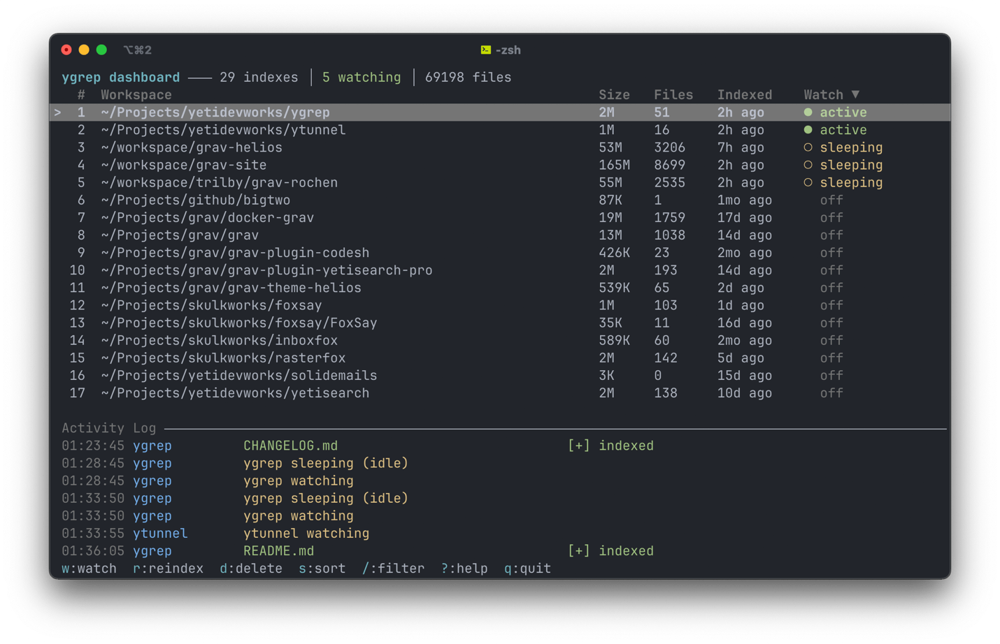

# ygrep

A fast, local, indexed code search tool optimized for AI coding assistants. Written in Rust using Tantivy for full-text indexing.



*The management TUI, captured before 4.0.0 added the service panel and the new key
bindings; the panel layout is otherwise current.*

## Features

- **Management TUI** - Bare `ygrep` on a terminal opens a dashboard for every index, the background service, and live activity
- **Background service** - Watches every index you flag, from login, without a terminal open
- **Literal text matching** - Works like grep by default, special characters included (`$variable`, `{% block`, `->get(`, `@decorator`)
- **Regex support** - Use `-r` flag for regex patterns (`fn\s+main`, `TODO|FIXME`)
- **Code-aware tokenizer** - Preserves `$`, `@`, `#` as part of tokens (essential for PHP, Shell, Python, etc.)
- **Subtoken matching** - camelCase and snake_case identifiers are split into subtokens, so `send` also finds `sendCampaign`, `send_email`, etc.
- **Multi-word AND queries** - `"campaign sending"` returns results where all terms appear in the file, not just exact adjacent phrases
- **Filename search** - Search matches file paths too, not just content
- **Fast indexed search** - Tantivy-powered BM25 ranking, instant results
- **Automatic indexing** - Searching an unindexed workspace builds the index and runs the query; nothing to set up
- **Incremental indexing** - Only re-indexes changed files based on mtime; no-op runs complete in ~10ms
- **Compact indexes** - Generated assets are skipped and the doc store is zstd-compressed, roughly halving index size
- **Non-blocking AI hooks** - Background indexing on session start, never slows down your AI tool
- **File watching** - Incremental index updates on file changes, per-index and remembered across runs
- **Query stats** - Every search is recorded locally so the TUI can show query rate, latency and misses
- **Optional semantic search** - HNSW vector index with local semantic model (all-MiniLM-L6-v2)
- **Symlink handling** - Follows symlinks with cycle detection
- **AI-optimized output** - Clean, minimal output with file paths and line numbers

## Installation

### Homebrew (macOS/Linux)

```bash
brew install yetidevworks/ygrep/ygrep
```

### From Source

```bash
# Using cargo (full features, requires ONNX Runtime)
cargo install --path crates/ygrep-cli

# Text search only (no ONNX dependency, faster build)
cargo install --path crates/ygrep-cli --no-default-features

# Or build release
cargo build --release
cp target/release/ygrep ~/.cargo/bin/
```

## Quick Start

### 1. Install for your AI tool

```bash
ygrep install claude-code    # Claude Code
ygrep install opencode       # OpenCode
ygrep install codex          # Codex
```

### 2. Search

```bash
ygrep "search query"         # Shorthand
ygrep search "search query"  # Explicit
```

That's it! The AI tool will now use ygrep for code searches.

The first search in a workspace builds a text index automatically, so there is no
separate setup step. Build one ahead of time, or opt into semantic search, with:

```bash
ygrep index                    # Fast text-only index
ygrep index --semantic         # With semantic search (better natural language queries)
```

## Usage

### Searching

```bash
# Basic search (literal text matching by default)
ygrep "$variable"                  # PHP/Shell variables
ygrep "{% block content"           # Twig templates
ygrep "->get("                     # Method calls
ygrep "@decorator"                 # Python decorators

# Regex search (use -r or --regex)
ygrep search "fn\s+\w+" -r         # Function definitions
ygrep search "TODO|FIXME" -r       # Multiple patterns
ygrep search "^import" -r          # Line anchors

# Subtoken matching (automatic with indexed search)
ygrep "send"                       # Also finds sendCampaign, send_email, etc.
ygrep "config load"                # AND match: files containing both terms

# Case-sensitive search (default is case-insensitive)
ygrep "Config" -s                  # Only matches exact case "Config"
ygrep search "IOException" -s      # Exact case match

# Context lines around matches
ygrep "error" -A 3                 # 3 lines after each match
ygrep "error" -B 2                 # 2 lines before each match
ygrep "error" -K 3                 # 3 lines before and after each match

# With options
ygrep search "error" -n 20         # Limit results
ygrep search "config" -e rs -e toml # Filter by extension
ygrep search "api" -p src/         # Filter by path

# Verbose mode (debug search pipeline)
ygrep "error" -e php -p src/ -v    # Shows per-stage filtering counts on stderr

# Output formats (AI format is default)
ygrep search "query"               # AI-optimized (default)
ygrep search "query" --json        # JSON output
ygrep search "query" --pretty      # Human-readable
```

### Indexing

```bash
ygrep index                        # Incremental update (only changed files)
ygrep index --rebuild              # Force full rebuild from scratch
ygrep index --semantic             # Build semantic index (sticky - remembered)
ygrep index --text                 # Build text-only index (sticky - remembered)
ygrep index /path/to/project       # Index specific directory
ygrep index --dry-run              # Report what would be indexed, build nothing
```

Indexing is **incremental by default** - only files with changed modification times are re-indexed. A no-op run (nothing changed) completes in ~10ms. Use `--rebuild` to force a full re-index.

#### Automatic indexing

Searching a workspace that has no index builds a text-only index, then runs the query:

```console
$ ygrep "compute_haystack"
No index for /path/to/project, building one (text-only)...
Indexing complete in 0.11s
# 1 results (text)
...
```

Semantic indexes are never built implicitly, since that downloads a model and takes
minutes. Run `ygrep index --semantic` when you want one.

Control it with `--no-auto-index` for a single run, or turn it off permanently:

```toml
[search]
auto_index = false
```

If the index directory is readable but not writable (a sandboxed process consuming a
centrally-maintained index), ygrep reports how to build the index rather than failing
to write one.

While a build is running, other searches report progress instead of claiming the
workspace is unindexed:

```console
$ ygrep "some query"
Index is being built for /path/to/project (running 1m 35s).
Retry the search shortly, or run `ygrep index` to build it in the foreground.
```

#### Keeping indexes current

Searches refresh the index themselves rather than telling you to. An index older than a
day gets an incremental pass first, which re-reads only files whose modification time
changed:

```console
$ ygrep "some query"
Index is out of date, refreshing...
Indexed 3 files in 0.24s (1.95 MB).
# 6 results (text)
...
```

An index left over from an older ygrep is rebuilt outright, since an outdated index
format can return wrong results rather than merely dated ones:

```console
$ ygrep "some query"
Index format changed, rebuilding...
Indexed 374 files in 0.23s (1.95 MB).
```

Both respect `--no-auto-index` and `search.auto_index`, and both fall back to a printed
note when the index directory isn't writable. The one exception is a **semantic** index
whose format is outdated: rebuilding it re-embeds every file, which takes minutes, so
ygrep asks rather than blocking your search. Run `ygrep index` when you see that.

#### What gets indexed

ygrep indexes source code, not build output or generated assets. Excluded by default:

- **Dependencies** - `node_modules`, `vendor`, `Pods`, `Carthage`, `.venv`
- **Build output** - `target`, `build`, `dist`, `out`, `bin`, `obj`, `DerivedData`, `.next`, `.nuxt`, `.svelte-kit`, `.turbo`
- **Compiled artifacts** - `*.a`, `*.rlib`, `*.rmeta`, `*.o`, `*.so`, `*.dylib`, `*.dSYM`, `*.xcarchive`
- **Binary and media files** - images, fonts, video, archives, documents, databases
- **Generated text** - bundled JavaScript, minified CSS, and compact data blobs

Dotfiles are no longer skipped wholesale. `.gitignore`, `.editorconfig`, `.env`,
`.eslintrc` and the rest of the recognised names are indexed, as are the source
directories `.github`, `.gitlab`, `.circleci`, `.devcontainer`, `.husky` and
`.changeset` — so `.github/workflows/*.yml` is searchable. Every other dot-directory is
still pruned, since it holds cache, credentials or tool state, and a hidden file whose
name isn't recognised is still left alone rather than sniffed.

When `indexer.respect_gitignore` is on, ignore rules are read the way git reads them:
nested `.gitignore` files, `.git/info/exclude`, and the global excludes file, not just
the one at the workspace root. They apply in a checkout with no `.git` of its own too, so
a worktree or a vendored copy is filtered the same way:

```toml
[indexer]
respect_gitignore = false   # default: ygrep's own ignore_patterns only
```

That last category is detected by how the file reads rather than by its name, since
bundled output is rarely called `*.min.js`. Any file whose average line length exceeds
`indexer.max_avg_line_length` (default 400 bytes) is treated as generated:

```toml
[indexer]
max_avg_line_length = 400   # set to 0 to index everything
```

Use `ygrep index --dry-run` to see exactly what would be indexed:

```console
$ ygrep index --dry-run
Would index /path/to/project (3009 files, 35.97 MB)

By extension:
  json            499 files    21.30 MB
  php             941 files     5.67 MB
  yaml            251 files     3.35 MB

Largest files:
   566.96 KB  assets/editor.js
   446.52 KB  tests/fixtures/tokens.json
```

#### Index size

Indexes are roughly half the size they were in 3.3.x. Two changes account for it:
generated assets are no longer indexed, and the doc store is compressed with zstd
instead of LZ4.

Measured by building each index with both releases and compacting to a single segment,
so segment count doesn't skew the comparison:

| Project | 3.3.2 | 3.4.0 | Change |
|---|---|---|---|
| php-project-1 (5.1k files) | 36.9 MB | 21.5 MB | **-42%** |
| php-project-2 (3.0k files) | 24.0 MB | 12.0 MB | **-50%** |
| php-project-3 (1.1k files) | 6.5 MB | 3.5 MB | **-46%** |
| swift-project-1 (374 files) | 3.0 MB | 1.8 MB | **-41%** |
| rust-project-1 (90 files) | 869 KB | 675 KB | **-22%** |

Projects with generated assets checked in gain the most. A pure source tree like
rust-project-1 gains only from compression, since nothing was being wrongly indexed.

Indexes shrink more than the excluded bytes alone would suggest, because minified files
tokenize badly and inflate the term dictionary and position lists out of proportion to
their size.

Existing indexes keep working and are rebuilt into the new format the next time you
search or index.

#### Compaction

Editing a file leaves its previous document behind as a tombstone in the segment that
held it. Tantivy schedules merges to reclaim that space, but they run on background
threads that don't outlive a short `ygrep index` process, so an index that is only ever
updated incrementally grows even though the code doesn't.

ygrep compacts an index once it passes `indexer.auto_compact_segments`:

```toml
[indexer]
auto_compact_segments = 16   # 0 disables
```

Measured on a 749-file workspace over 20 rounds of editing 35 files each, with the code
itself growing by 60 KB:

| | Index | Segments |
|---|---|---|
| Without compaction | 2.22 MB → **6.30 MB** | 3 → 52 |
| With compaction | 2.22 MB → **2.81 MB** | 3 → 9 |

Growth was previously linear with no ceiling; it now oscillates in a band and stays
there. Segments cost search time too: that index searched in 24.5 ms at 32 segments
versus 21.6 ms at 1.

Compaction takes under half a second on a 5k-file index, so it runs occasionally rather
than slowing every build. `ygrep indexes list` marks any index carrying reclaimable
space, and `ygrep indexes compact` forces the pass by hand.

The doc store compression level is tunable. Higher levels build a smaller index more
slowly; search speed is unaffected either way, since a query decompresses only the few
blocks holding its results:

```toml
[indexer]
docstore_compression_level = 6   # 1-22 for zstd, or 0 for LZ4
```

Measured on php-project-1 (5.1k files), compacted to one segment:

| Level | Index | Doc store | Build |
|---|---|---|---|
| 0 (LZ4) | 26.6 MB | 13.5 MB | 1.18s |
| 3 | 22.3 MB | 9.1 MB | 1.12s |
| **6 (default)** | **21.5 MB** | **8.4 MB** | **1.14s** |
| 9 | 21.3 MB | 8.2 MB | 1.16s |
| 12 | 21.3 MB | 8.1 MB | 1.36s |

Level 6 is the knee of the curve: three quarters of the available size gain for a build
cost inside measurement noise. Past it the returns collapse, with 12 costing 20% more
build time for a further 1%.

Search latency is flat across every level (26-27 ms on this workspace, dominated by
process startup), because a query decompresses only the blocks holding its results
rather than streaming the store.

The `--semantic` and `--text` flags are **sticky** - once set, subsequent `ygrep index` commands (without flags) will remember and use the same mode. This also applies to `ygrep watch`.

When upgrading ygrep to a new version with schema changes, the index is automatically rebuilt on the next `ygrep index` run.

### File Watching

```bash
ygrep watch                        # Watch current directory (honors stored mode)
ygrep watch /path/to/project       # Watch specific directory
```

File watching automatically uses the same mode (text or semantic) as the original index.
It holds the terminal for as long as you want the index current, which is why the watch
flag and the background service exist: flag the workspaces worth watching and the service
keeps them current in the background from login onwards.

```bash
ygrep indexes watch on                # Watch the current workspace's index
ygrep indexes watch off               # Stop watching it
ygrep indexes watch <hash|path> on    # Name an index instead
```

The flag lives in the index's own metadata, so it survives re-indexing, upgrades and
reboots, and `ygrep indexes list` marks the indexes carrying it. The TUI toggles the same
flag with `w`, and a running service picks the change up on its next rescan without being
restarted.

### Background Service

The service watches every watch-enabled index, in one process, starting at login. It is a
user-level launchd agent on macOS and a systemd user unit on Linux — no root, no daemon
config to write:

```bash
ygrep service install              # Install and start it
ygrep service status               # Installed? running? what is it watching?
ygrep service start                # Start / stop / restart the installed service
ygrep service stop
ygrep service restart
ygrep service log                  # Tail the service log (-f to follow)
ygrep service uninstall            # Stop it and remove the definition
```

`ygrep service status` reports whether the definition is installed, whether the process is
running, its pid, and how many indexes it is watching. Logs go to
`<data_dir>/logs/service.log`, capped at 5 MB with one old generation kept.

The service re-reads the index registry every 30 seconds, so a watch flag toggled in the
TUI or from another terminal takes effect within that window, and an index built after the
service started is picked up without a restart. A single-instance lock in the data
directory keeps a second copy from starting, and on SIGTERM or Ctrl-C it stops its
watchers and compacts the indexes that need it rather than exiting mid-write.

```toml
[service]
registry_rescan_secs = 30   # how often the registry is re-read
log_max_size_mb = 5         # rotate the log past this size
```

Re-run `ygrep service install` after the binary moves — a `cargo install`, a Homebrew
upgrade — so the service definition points at the new path.

`ygrep service run` is the foreground loop the service definition invokes. It works by
hand for debugging, but the installed service is the supported way to run it.

### Status

```bash
ygrep status                       # Show index status
ygrep status --detailed            # Detailed statistics
```

### Index Management

```bash
ygrep indexes list                 # List all indexes with sizes and type
ygrep indexes clean                # Remove orphaned indexes (freed disk space)
ygrep indexes remove <hash>        # Remove specific index by hash
ygrep indexes remove /path/to/dir  # Remove index by workspace path
ygrep indexes remove <hash> --dry-run  # Show what would be removed, delete nothing
ygrep indexes remove <hash> --yes      # Skip the confirmation prompt
ygrep indexes compact [<hash|path>]    # Merge segments and reclaim deleted documents
ygrep indexes watch <hash|path> on|off # Watch this index from the background service
```

`remove` and `clean` only ever delete inside ygrep's own index directory — the
workspace you point them at is never touched. Both prompt for confirmation when run
interactively; pass `--yes` in scripts, or `--dry-run` to preview.

Example output:
```
# 2 indexes (24.0 MB)

1bb65a32a7aa44ba  319.4 KB  [text]
  /path/to/project

c4f2ba4712ed98e7  23.7 MB  [semantic]
  /path/to/another-project
```

### Management TUI

Run `ygrep` with no query and no subcommand on a terminal and it opens the management
dashboard instead of printing help:

```bash
ygrep                              # Management TUI
ygrep dashboard                    # Same screen, explicitly
```

Piping and scripting are unaffected: unless both stdin and stdout are terminals, bare
`ygrep` prints help as it always has, so `ygrep | head`, `ygrep > file` and CI invocations
never open a TUI or block waiting for a keypress.

Three stacked panels, plus a title bar carrying the version, the service state and the
total index count and size:

- **Indexes** - one row per index: watch state (● watching, ◐ sleeping, ○ idle, ✗ error),
  workspace path, size on disk, file count, segment count, a semantic badge, when it was
  last indexed, changes per minute while watching, and `[w]` when the persisted watch flag
  is on. Sort with `1`-`4`, filter with `/`.
- **Service** - installed, running, pid, uptime, how many indexes it is watching, when it
  last rescanned the registry, and the log path.
- **Activity** - a live tail of what the watchers are doing: files indexed and removed,
  workspaces going to sleep and waking, compaction notices, errors.

Press `t` for the query stats view: queries per second as a sparkline, total queries,
average and slowest query time, how many returned nothing, the most-run queries and
busiest workspaces as bars, and a live tail of recent searches with their timing and hit
count. `/` filters the tail, `esc` goes back.

**Key bindings** (`?` shows the same list in the TUI):

| Key | Action |
|-----|--------|
| `↑/↓` or `j/k` | Move, and scroll the focused panel |
| `Tab` | Switch focus between Indexes and Activity |
| `1`-`4` | Sort by name / size / age / files (again reverses) |
| `/` | Filter indexes by path |
| `Enter` | Start or stop watching for this session |
| `w` | Toggle the persisted watch flag the service reads |
| `i` | Re-index the selected workspace |
| `c` | Compact the selected index |
| `R` or `Del` | Remove the selected index (confirmation required) |
| `o` | Open the workspace in the file manager |
| `g` | Follow or pause the activity panel |
| `t` | Query stats: rate, top queries, live tail |
| `S` | Service menu: install, start, stop, restart |
| `?` | Help overlay |
| `q` or `Esc` | Quit |

Re-indexing and compaction run in the background, so a big workspace never freezes the
screen, and an operation that fails reports on the status line rather than tearing the TUI
down.

### Query Stats

Every search appends one JSON line to `<data_dir>/telemetry/queries.jsonl`: a timestamp,
the index hash of the workspace, the query text truncated to 200 characters, how long the
query took, how many hits it returned, and whether it ran as a literal, regex or hybrid
search. That file is what the TUI's stats view reads.

It never leaves the machine. There is no upload, no network call and no identifier beyond
the workspace hash already used to name the index directory. The log rotates at 5 MB and
one old generation is kept, so it cannot grow without bound. Writing it is best-effort: a
search that found what you asked for never fails because a log line couldn't be written.

Turn it off and the stats view stays empty:

```toml
[output]
telemetry = false
```

### Updating

```bash
ygrep update                       # Check and install latest version
ygrep update --check               # Just check, don't install
```

ygrep automatically checks for updates once per day (in the background, after search) and shows a hint when a new version is available:

```
ygrep v3.2.0 available (current: v3.1.6). Run `ygrep update` to upgrade.
```

If installed via Homebrew or cargo, `ygrep update` will suggest the appropriate command (`brew upgrade ygrep` or `cargo install ygrep-cli`) instead of self-updating.

### Semantic Search (Optional)

Enable semantic search for better results on natural language queries:

```bash
# Build semantic index (one-time, slower - mode is remembered)
ygrep index --semantic

# Search automatically uses hybrid mode when semantic index exists
ygrep "authentication flow"        # Uses BM25 + semantic search

# Force text-only search (single query, doesn't change index mode)
ygrep search "auth" --text-only

# Future index/watch commands remember the mode
ygrep index                        # Still semantic
ygrep watch                        # Watches with semantic indexing

# Convert back to text-only index
ygrep index --text
```

Semantic search uses the `all-MiniLM-L6-v2` model (~25MB, downloaded on first use).

**Note:** Semantic search requires ONNX Runtime and is only available on certain platforms:
- ✅ macOS ARM64 (Apple Silicon)
- ✅ Linux x86_64
- ❌ macOS x86_64 (Intel) (text search only)
- ❌ Windows x86_64 (text search only)
- ❌ Linux ARM64/ARMv7/musl (text search only)

On unsupported platforms, ygrep works normally with BM25 text search - the `--semantic` flag will print a warning.

## AI Tool Integration

ygrep integrates with popular AI coding assistants:

### Claude Code

```bash
ygrep install claude-code          # Install plugin
ygrep uninstall claude-code        # Uninstall plugin
```

After installation, restart Claude Code. The plugin:
- Runs `ygrep index` in the background on session start (non-blocking)
- Provides a skill that teaches Claude to prefer ygrep over built-in search

**Important:** At the start of each session, run `/ygrep` to load the skill. This tells Claude to use ygrep for code searches instead of its built-in Grep/Glob tools. Without loading the skill, Claude will default to its slower built-in search.

### OpenCode

```bash
ygrep install opencode             # Install skill
ygrep uninstall opencode           # Uninstall skill
```

### Codex

```bash
ygrep install codex                # Install skill
ygrep uninstall codex              # Uninstall skill
```

## Example Output

### AI Format (Default)

Optimized for AI assistants - single line header with score and match type:

```
# 5 results (3 text + 2 semantic)

src/config.rs:45 (85%) +
  pub struct Config {

src/main.rs:12 (72%) ~
  fn main() -> Result<()> {

src/lib.rs:100 (65%)
  let workspace = Workspace::open(&config)?;
```

**Format:** `path:line (score%) [match_indicator]`
- `+` = Hybrid match (both text AND semantic)
- `~` = Semantic only (no exact text match)
- No indicator = Text only

### JSON Format

Full metadata with `--json`:

```json
{
  "hits": [...],
  "total": 5,
  "query_time_ms": 42,
  "text_hits": 3,
  "semantic_hits": 2
}
```

Each hit includes `match_type`: `"Text"`, `"Semantic"`, or `"Hybrid"`.

### Pretty Format

Human-readable with `--pretty`:

```
# 5 results (3 text + 2 semantic)

src/config.rs:45-67
  45: pub struct Config {
  46:     pub data_dir: PathBuf,
  47:     pub max_file_size: u64,

src/main.rs:12-28
  12: fn main() -> Result<()> {
  13:     let config = Config::load()?;
  14:     let workspace = Workspace::open(&config)?;
```

## How It Works

1. **Indexing**: Walks directory tree, indexes text files with Tantivy using a code-aware tokenizer
2. **Incremental updates**: Compares file modification times against the index using fast columnar fields; only changed, new, or deleted files are processed
3. **Tokenizer**: Custom tokenizer preserves code characters (`$`, `@`, `#`, `-`, `_`) as part of tokens, and emits subtokens for camelCase and snake_case identifiers
4. **Search**: BM25-ranked literal search (default) or regex matching with `-r` flag, plus optional semantic search
5. **Results**: Returns matching files with line numbers and context

## Performance

Measured against 3.5.1 on an M4 Max (14 cores, 36 GB RAM), median of 3 runs for builds
and 10 for queries, each version indexing into its own data directory:

| Workload | Corpus | 3.5.1 | 4.0.0 |
|---|---|---|---|
| No-op `ygrep index` | 8.5k files, 11 MB | 615 ms | **249 ms** |
| No-op `ygrep index` | 44.8k files, 350 MB | 3.45 s | **0.84 s** |
| Full build | 8.5k files, 11 MB | 892 ms | **433 ms** |
| Full build | 44.8k files, 350 MB | 10.2 s | 11.1 s |
| `<<<` literal query | 44.8k files, 350 MB | 197 ms | **45 ms** |
| `->` literal query | 44.8k files, 350 MB | 14.6 ms | **10.5 ms** |
| `-e c malloc` query | 44.8k files, 350 MB | 25 ms, 61 hits | **13 ms, 100 hits** |

An unchanged tree is now decided from the directory metadata the walk already carries,
rather than re-reading and re-stat-ing every file, so repeat runs cost a fraction of what
they did. Punctuation-heavy queries are pre-filtered by any alphanumeric part of the
query, and what still has to be scanned is scanned across segments in parallel. Extension
and path filters are applied before the result limit rather than after, so a filtered
query fills its page instead of returning whatever survived truncation - that last row
returns 39 results 3.5.1 dropped.

Two costs came with it, both from walking in parallel. On a 350 MB tree the build is
already saturated by Tantivy's own indexing threads, so the parallel walk adds 9% build
time, and interleaving unrelated files into the doc store's 64 KB compression blocks
costs 12% more disk (202 MB vs 180 MB). Restoring the sequential walk gives back both,
and the incremental win is unaffected:

```toml
[indexer]
threads = 1   # 0 = one per core
```

A multi-word literal query asking for more results than exist still costs more, since it
always escalates to a deeper candidate pool: a two-word query with 84 matches takes
138 ms at `-n 100` against 113 ms, and 7 ms at `-n 20` against 9 ms. Most of that gap is
the larger doc store - the same query against an index built with `threads = 1` takes
120 ms.

Full tables and the script that produced them are in `benchmark/compare-3.5-vs-4.0/`.

## Development

### Running Tests

```bash
cargo test --workspace              # Run all tests
cargo test -p ygrep-core            # Run core library tests only
cargo test -p ygrep-core -- search  # Run tests matching "search"
```

### Code Quality

```bash
cargo fmt --all -- --check          # Check formatting
cargo clippy --workspace --all-targets  # Lint
```

### Building

```bash
cargo build --release               # Build release binary
cargo install --path crates/ygrep-cli   # Install to ~/.cargo/bin/
```

## Configuration

Index data stored in:
- macOS: `~/Library/Application Support/ygrep/indexes/`
- Linux: `~/.local/share/ygrep/indexes/`

Configuration is read from the first of these that exists: `./.ygrep.toml`,
`$XDG_CONFIG_HOME/ygrep/config.toml`, `~/.config/ygrep/config.toml`. Every key has a
default, so a config file only needs the ones you want to change.

```toml
[indexer]
threads = 0                     # walk and index workers, 0 = one per core (max 8)
writer_heap_mb = 50             # tantivy writer heap for a full build
max_file_size = 10485760        # skip files larger than this
max_avg_line_length = 400       # skip generated files, 0 indexes everything
docstore_compression_level = 6  # zstd level, or 0 for LZ4
auto_compact_segments = 16      # compact past this many segments, 0 disables
respect_gitignore = false       # honour .gitignore, nested files included
follow_symlinks = true

[search]
auto_index = true               # build a text index when searching an unindexed workspace
default_limit = 10
max_limit = 100

[service]
registry_rescan_secs = 30       # how often the service re-reads the index registry
log_max_size_mb = 5             # rotate the service log past this size

[output]
telemetry = true                # record queries locally for the TUI stats view
```

`indexer.threads` controls the parallel walk. On a large tree that Tantivy's own indexing
threads already saturate, `threads = 1` builds a slightly smaller index in slightly less
time — see [Performance](#performance). `writer_heap_mb` is the heap a full build gives
the writer; watchers and single-file indexers always use Tantivy's 15 MB minimum, so
raising it costs nothing while idle.

## Upgrading

```bash
# Self-update (downloads latest release binary)
ygrep update

# Via Homebrew
brew upgrade ygrep

# Indexes auto-rebuild when schema changes are detected
ygrep index

# If upgrading to v3.0.6+, rebuild is required for filename search
ygrep index --rebuild
```

## Windows Build Prerequisites: C++ SDK & Build Tools

Building this project on Windows requires **MSVC Build Tools** and the **Windows SDK** because several dependencies compile native C/C++ code.

### Install Rust

```bash
winget install Rustlang.Rustup
```

### Install MSVC Build Tools

Install **Visual Studio Build Tools 2022** (or latest) with the following workloads:
- **"Desktop development with C++"** — includes MSVC compiler and Windows SDK
- Alternatively, install the individual components: **MSVC v143+ C++ build tools** and **Windows 10/11 SDK**

Download: https://visualstudio.microsoft.com/visual-cpp-build-tools/

### Dependencies that require C/C++ compilation

| Crate | Why | Used by |
|-------|-----|---------|
| `ort-sys` | ONNX Runtime C++ bindings | `ort` → `fastembed` (ML inference) |
| `onig_sys` | Oniguruma regex engine (C library) | `onig` |
| `zstd-sys` | Zstandard compression (C library) | `zstd` |
| `ring` | Cryptography (C/assembly) | `rustls` (TLS) |

The `cc` crate handles compiling C/C++ code from Rust build scripts, and `find-msvc-tools` (used by `ort-sys`) locates the MSVC installation on your system.

**`fastembed` → `ort` → `ort-sys`** is the primary reason MSVC Build Tools are needed, since ONNX Runtime is a substantial C++ dependency.

### Build

```bash
cargo build --release
```

The compiled binary will be at `target\release\ygrep.exe`. To make it available system-wide, either:

- **Copy to a directory already on your PATH:**
  ```bash
  copy target\release\ygrep.exe %USERPROFILE%\.cargo\bin\
  ```
- **Or add the build output directory to your PATH:**
  Go to **Settings > System > About > Advanced system settings > Environment Variables**, then add the `target\release` path to your user `Path` variable.

## License

MIT
